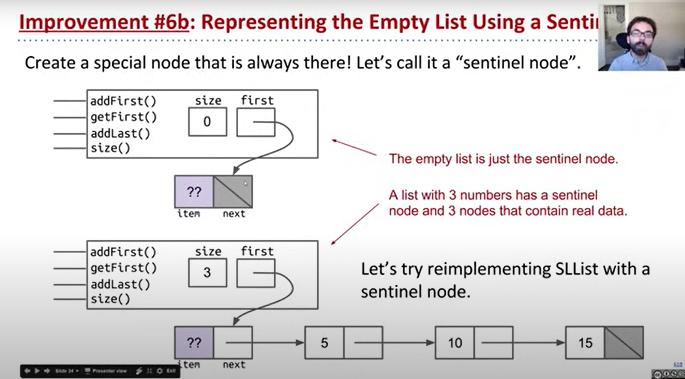

# 4. CS61B: Data Structures and Algorithms

Status: In Progress
Project: CS (https://www.notion.so/CS-13eb34e8f75180fcb91bfe0b305925a7?pvs=21)
子任务: 笔记 (https://www.notion.so/16bb34e8f7518089a29ee6477a8a3c75?pvs=21)
日期: 2024年12月29日



哨兵节点 Sentinel Node 

proj1b 后半部分抛弃 lec11迭代器部分

## ADT 抽象数据类型

- stack 栈 - 支持 “ 先进后出 ”
- lists 列表 - 一组有序元素
- map 映射- 键/值对集
- array 和 list 的对比：

| 特性 | 数组（Array） | 列表（List） |
| --- | --- | --- |
| **大小** | 固定大小，创建时指定大小 | 动态大小，可以根据需要增加或减少 |
| **类型** | 元素类型必须相同 | 元素类型可以相同或不同（取决于实现） |
| **存储** | 存储基本数据类型（如 `int`、`char` 等） | 存储对象类型（如 `Integer`、`String` 等） |
| **性能** | 访问速度较快，性能较高 | 访问速度较慢，但支持动态调整和插入删除 |
| **存储重复元素** | 不允许（必须使用手动操作去重） | 允许存储重复元素 |
| **支持的操作** | 通过索引直接访问和修改元素 | 支持更多操作，如插入、删除、动态扩展 |
| **实现类** | 只有一个实现：`Array` | 有多种实现：`ArrayList`、`LinkedList` 等 |
| 适合场景 | 快速访问且数据大小固定 | 需要动态扩展、频繁插入、删除和修改元素的场景 |

## Asymptotics 渐进分析


不同时间复杂度的实现 Θ(N)、Θ(log N)、Θ(1)、Θ(2^N)

```java
// Desired Runtime: Θ(N)
// Note the solution could be i += C, where C is some constant independent of N.
// This is because even if we did for example, i += 10, we would do N/10 work in total, which is still Θ(N).
public static void f1(int N) {
    for (int i = 1; i < N; i += 1) {
        System.out.println("hi Dom");
    }
}

// Desired Runtime: Θ(log N)
// Here, the solution could be i *= C, where C is some constant independent of N.
// This is because even if we did for example, i *= 5, we would do log5(N) work in total, and in general logi(N) work, which is still O(log n).
public static void f2(int N) {
    for (int i = 1; i < N; i *= 2) {
        System.out.println("howdy Ergun");
    }
}

// Desired Runtime: Θ(1)
// Again, the solution is actually just i < C, where C is some constant independent of the input N.
public static void f3(int N) {
    for (int i = 1; i < 1000; i += 1) {
        System.out.println("hello Anniyat");
    }
}

// Desired Runtime: Θ(2^N)
// This one is tricky! Hint: think about the dominating term in 1 + 2 + 4 + 8 + ... + f(N)
public static void f4(int N) {
    for (int i = 1; i < Math.pow(2, N); i *= 2) {
        for (int j = 0; j < i; j += 1) {
            System.out.println("what's up Alyssa");
        }
    }
}
```

## Binary Search Tree (BST) 二叉搜索树

1. 链表+二分搜索思想 → 二叉树
    
    二分搜索树额外的限制条件在于节点的**有序性：**
    
    > *左子树中所有节点的值都小于该节点的值，而其右子树中所有节点的值都大于该节点的值。*
    > 


*binary* tree → 0, 1, 2 branches （很好理解，因为本身就来自于二分法）

1. 主要分为三个方法：search, insert, deletion

**insert:**

```java
    static BST insert(BST T, Key ik) {
        if (T == null)
            return new BST(ik);
        if (ik ≺ T.key)
            T.left = insert(T.left, ik);  //赋值回去这一步非常关键！
        else if (ik ≻ T.key)
            T.right = insert(T.right, ik);
        return T;

```

赋值回去这一步非常关键：

> *递归调用可能会返回一个新的子树根节点，赋值的作用就是把改变后的子树重新连接回原来的树。如果不赋值，递归的结果只是临时修改了某个子树，但没有反映在完整的树结构中。*
> 

> *因为递归调用可能会创建一个新节点或修改子树结构，返回值是更新后的子树根节点。*
> 

BST Performances

- **“height”** - determines the worst case runtime to find a node
- **“average depth”** - average case runtime to find a node

1. 局限性
    
    BSTs have:
    
    - Worst case Θ(N) height.
    - Best case Θ(log N) height.
    - Θ(log N) height if constructed via random inserts. (但实际上我们不可能做到随机，因为我们无法提前存储数据 )


## B-Trees

BST的改进版

1. 优点：可以做到完全平衡 → 高度低 → 性能高，插入、删除、查找速度快
- split root → every node gets pushed down by exactly one level.
- split leaf /internal node → the height doesn’t change.

1. 时间复杂度：**Θ(log N)**

高度为H=Θ(log N)，最坏情况下要遍历H+1个节点，每个节点遍历长度为L，运行时间即为O(HL)。

化简得t=O(L log N)=O(log N)


1. 从B-Tree的构建方式我们可以推断出两个结论
    - All leaves must be the same distance from the root.
    - A non-leaf node with k items must have exactly k+1 children.
2. 应用：（L很大）文件管理系统、数据库